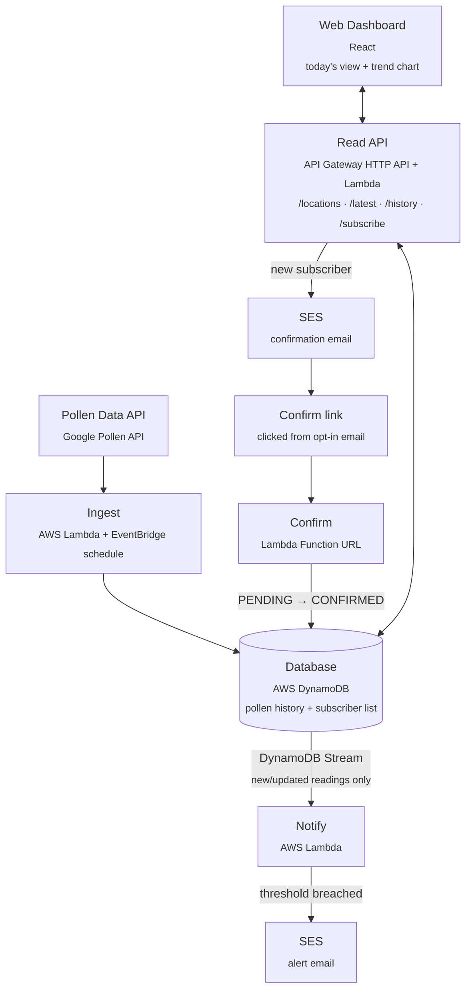

# Allergy Tracker

A small end-to-end system that pulls daily pollen forecasts, stores the history, shows it on a
web dashboard, and emails subscribers when pollen counts spike.

**Live:** https://d3myi08baazbck.cloudfront.net (default CloudFront domain — no custom domain
yet, see Phase 6 of the plan)

## How it works
1. A scheduled job (`ingest`) fetches pollen data for one or more locations from the **Google
   Pollen API** and writes each reading to the database — no threshold logic here, so a slow
   SES send or subscriber-check bug can never stop a forecast from being fetched.
2. Every write to the database streams to a second job (`notify`), which checks it against each
   confirmed subscriber's threshold and sends an alert via **SES** on a breach.
3. New subscribers go through double opt-in: created `PENDING`, and a third job (`confirm`,
   a public Lambda Function URL) has to see the right one-time token before they become
   `CONFIRMED` and start receiving alerts.
4. A **web dashboard** reads today's levels and the trend history through a **read API**
   (API Gateway HTTP API + Lambda), never straight from DynamoDB — there's no safe way to scope
   database credentials in a browser. The same API serves the subscribe form, which kicks off
   the opt-in email in step 3.



## Tech stack

| Component          | Choice                          | Notes |
|---------------------|----------------------------------|-------|
| Pollen data source   | Google Pollen API (`pollen.googleapis.com`) | Requires a Google Cloud API key |
| Ingestion job        | AWS Lambda + EventBridge (scheduled rule) | Serverless, cheap, runs a few times a day |
| Database              | AWS DynamoDB                    | Single-table design: pollen history + subscribers |
| Read API              | API Gateway **HTTP API** + Lambda | Sits between dashboard and DynamoDB; HTTP API, not REST — ~3.5x cheaper per request |
| Web dashboard         | React                            | Today's view, trend chart, subscribe form |
| Email notifier        | AWS SES + Lambda                 | Triggered by DynamoDB Streams, decoupled from ingestion |
| Double opt-in confirm | Lambda Function URL              | Free, single public route — not folded into the read API |
| Infra as code         | AWS SAM                          | Decided in Phase 0 — simplest fit for a Lambda-centric app |

## Repository layout

```
.github/workflows/ci.yml      # Test/lint/build on every PR+push; deploy both stacks on push to main
infra/template.yaml           # AWS SAM stack: table, 4 Lambdas, schedule, stream trigger, HTTP API, Function URL, alarm
infra/hosting-template.yaml   # Static hosting stack: S3 + CloudFront for the dashboard
infra/github-oidc-template.yaml   # One-time: IAM role CI assumes via GitHub OIDC (no long-lived AWS keys)
infra/samconfig-*.toml        # Non-interactive `sam deploy` config, shared by CI and local deploys
services/
  src/
    common/           # Shared by all four Lambdas
      pollen_api.py   #   Google Pollen API client + response parsing (pure functions)
      store.py        #   DynamoDB access; all key construction lives here
      config.py       #   Env vars + SSM secret resolution
      ses.py          #   Alert + confirmation email sending
    ingest/           # Fetches forecasts, writes readings (EventBridge schedule)
    notify/           # Reacts to new readings via DynamoDB Stream, sends alert emails
    confirm/          # Double opt-in click target (Lambda Function URL)
    api/              # Read API for the dashboard, behind the API Gateway HTTP API
  tests/              # Unit tests for parsing/threshold/stream-filtering/API logic (no AWS needed)
ui/                   # React dashboard
scripts/              # fetch_pollen_sample.py, seed_locations.py, seed_subscriber.py
docs/                 # Design notes
```

## Documentation

| Doc | What's in it |
|-----|--------------|
| [`docs/IMPLEMENTATION_PLAN.md`](docs/IMPLEMENTATION_PLAN.md) | Phased build-out plan |
| [`docs/DATA_MODEL.md`](docs/DATA_MODEL.md) | DynamoDB single-table schema and access patterns |
| [`docs/CONFIGURATION.md`](docs/CONFIGURATION.md) | Where the API key goes, env vars, AWS credentials |
| [`docs/TEARDOWN.md`](docs/TEARDOWN.md) | How to fully delete the AWS stack (cost safety net) |

## Getting started

### 1. Get a Pollen API key

Enable the **Pollen API** in a Google Cloud project and create an API key. Restrict it to the
Pollen API only — see [`docs/CONFIGURATION.md`](docs/CONFIGURATION.md).

### 2. See what the API returns

```bash
export GOOGLE_POLLEN_API_KEY=your-key
python scripts/fetch_pollen_sample.py --lat 49.2827 --lng -123.1207
```

### 3. Run the tests

No AWS account or API key needed — the parsing and threshold logic are pure functions.

```bash
cd services
pip install -r requirements.txt
python -m pytest tests/ -q
```

### 4. Deploy

```bash
# Store the key once, as a SecureString
aws ssm put-parameter --name /allergy-tracker/google-pollen-api-key \
  --value "$GOOGLE_POLLEN_API_KEY" --type SecureString --overwrite

# Verify a sender identity for alert/confirmation emails (see docs/CONFIGURATION.md — SES
# starts in the sandbox, so your test recipient needs verifying too if it's a different address)
aws ses verify-email-identity --email-address you@example.com

sam build -t infra/template.yaml --use-container
sam deploy --guided -t infra/template.yaml --parameter-overrides SesSenderEmail=you@example.com

# Tell the ingestion job which locations to fetch
DDB_TABLE_NAME=allergy-tracker python scripts/seed_locations.py

# Trigger a run without waiting for the schedule
aws lambda invoke --function-name allergy-tracker-ingest /dev/stdout

# Create a test subscriber (prints a confirm link instead of emailing it — see
# scripts/seed_subscriber.py). Get CONFIRM_BASE_URL from the stack's ConfirmFunctionUrl output.
DDB_TABLE_NAME=allergy-tracker CONFIRM_BASE_URL=<ConfirmFunctionUrl output> \
  python scripts/seed_subscriber.py --location vancouver --email you@example.com --threshold 0
```

### 5. Try the read API

`ApiEndpoint` is in the stack's outputs. Unlike `seed_subscriber.py`, `POST /subscribe` emails
the confirm link rather than printing it.

```bash
API=$(aws cloudformation describe-stacks --stack-name allergy-tracker \
  --query "Stacks[0].Outputs[?OutputKey=='ApiEndpoint'].OutputValue" --output text)

curl "$API/locations"
curl "$API/pollen/vancouver/latest"
curl "$API/pollen/vancouver/history?days=7"
curl -X POST "$API/subscribe" -H 'Content-Type: application/json' \
  -d '{"email":"you@example.com","location":"vancouver","threshold":0}'
```

### 6. Web dashboard (React)

Location picker, today's-pollen cards (with per-allergen icons), a trend chart, and a subscribe
form — talks only to the read API above, never to DynamoDB directly.

```bash
cd ui
npm install
cp .env.example .env.local   # fill in VITE_API_BASE_URL from the ApiEndpoint output above
npm run dev
```

Hosted at https://d3myi08baazbck.cloudfront.net (S3 + CloudFront, `infra/hosting-template.yaml`).
To redeploy after a change:

```bash
npm run build
aws s3 sync dist/ s3://<BucketName from the hosting stack output> --delete
```

## Status

| Phase | State |
|-------|-------|
| 0 — Setup, IaC choice (SAM) | Done — IAM identity, SAM CLI, and SSM parameter all verified working |
| 1 — Data model | Done — [`docs/DATA_MODEL.md`](docs/DATA_MODEL.md), verified against a real API response |
| 2 — Ingestion Lambda | Done — deployed to `ca-central-1`, invoked live, and the 3 written DynamoDB items were independently queried and confirmed to match the data model (including `GRASS` correctly stored as `upi: null`, not `0`) |
| 3 — Email notifier (SES) | Done — decoupled `notify` Lambda off the DynamoDB Stream, double opt-in via a `confirm` Function URL, verified end to end with real SES sends (delivery attempts confirmed via `get-send-statistics`) |
| 4 — Read API | Done — HTTP API + `api` Lambda (`/locations`, `/latest`, `/history`, `/subscribe`), per-route throttling, CORS; deployed to the live stack via a reviewed changeset and verified against it (all four routes hit for real, including a `POST /subscribe` against an already-confirmed address to check the overwrite guard) |
| 5 — React dashboard | Done — location picker, today's-pollen cards with per-allergen icons and a brand identity, Recharts trend line, subscribe form; verified in a headless browser (light + dark, no console errors) against the live API |
| 6 — Deployment & CI | CI/CD written (`.github/workflows/ci.yml`: tests/lint/build on every PR and push, deploy on push to `main` via GitHub OIDC, no long-lived AWS keys) but not yet live — needs a one-time manual deploy of `infra/github-oidc-template.yaml` and a GitHub secret, see [`CONFIGURATION.md`](docs/CONFIGURATION.md#cicd-one-time-setup-phase-6). Until then both stacks still deploy manually as described below |
| 7 — Observability | Partial — error alarm + log retention in the template; SNS alerting and custom metrics not yet added |
