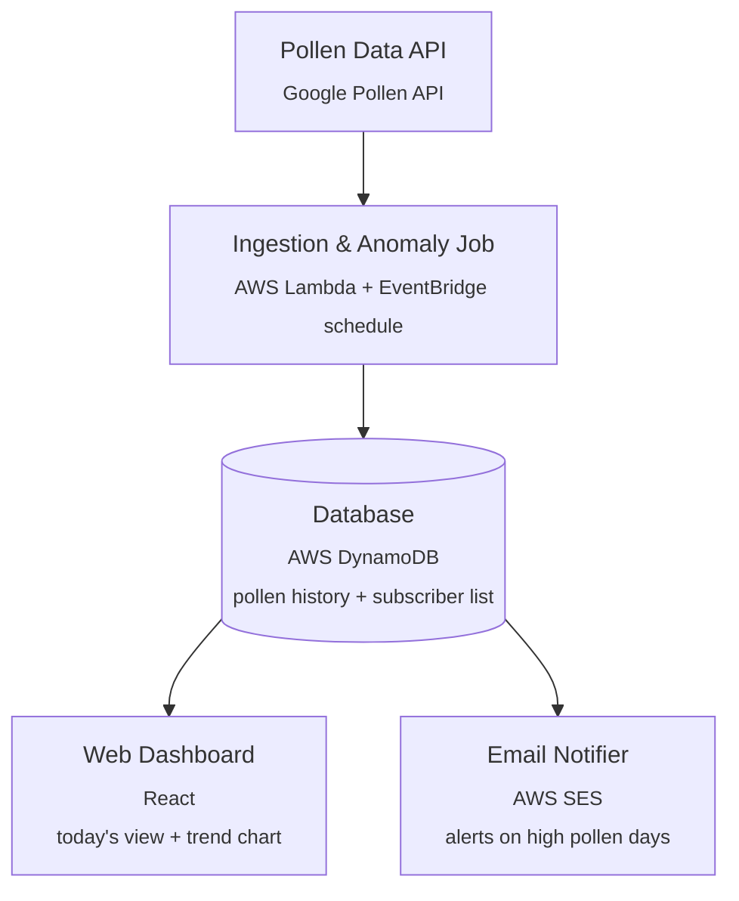

# Allergy Tracker

A small end-to-end system that pulls daily pollen forecasts, stores the history, shows it on a
web dashboard, and emails subscribers when pollen counts spike.

## How it works
1. A scheduled job fetches pollen data for one or more locations from the **Google Pollen API**.
2. The job checks the result against a per-subscriber threshold ("anomaly check") and writes the
   reading to the database either way, so history builds up over time.
3. A **web dashboard** reads that history to show today's pollen levels and a trend chart.
4. When a reading crosses a subscriber's threshold, an **email notifier** sends an alert.



> **Note on the diagram:** the dashboard is drawn reading straight from DynamoDB for simplicity,
> matching the original design. In practice the React app shouldn't talk to DynamoDB directly
> (no safe way to scope credentials in a browser). Phase 6 below adds a thin read API
> (API Gateway + Lambda) between the dashboard and the database — see
> [`docs/IMPLEMENTATION_PLAN.md`](docs/IMPLEMENTATION_PLAN.md).

## Tech stack

| Component          | Choice                          | Notes |
|---------------------|----------------------------------|-------|
| Pollen data source   | Google Pollen API (`pollen.googleapis.com`) | Requires a Google Cloud API key |
| Ingestion job        | AWS Lambda + EventBridge (scheduled rule) | Serverless, cheap, runs a few times a day |
| Database              | AWS DynamoDB                    | Single-table design: pollen history + subscribers |
| Read API              | API Gateway + Lambda            | Sits between dashboard and DynamoDB |
| Web dashboard         | React                            | Today's view, trend chart, subscribe form |
| Email notifier        | AWS SES                          | Triggered by the ingestion job or DynamoDB Streams |
| Infra as code         | AWS SAM or CDK                  | TBD in Phase 0 |

## Repository layout

```
infra/template.yaml   # AWS SAM stack: DynamoDB table, ingestion Lambda, schedule, alarm
services/
  src/ingest/         # Ingestion Lambda
    handler.py        #   Lambda entry point: fetch -> store -> threshold check
    pollen_api.py     #   Google Pollen API client + response parsing (pure functions)
    store.py          #   DynamoDB access; all key construction lives here
    config.py         #   Env vars + SSM secret resolution
  tests/              # Unit tests for parsing and threshold logic (no AWS needed)
ui/                   # React dashboard
scripts/              # fetch_pollen_sample.py, seed_locations.py
docs/                 # Design notes
```

## Documentation

| Doc | What's in it |
|-----|--------------|
| [`docs/IMPLEMENTATION_PLAN.md`](docs/IMPLEMENTATION_PLAN.md) | Phased build-out plan |
| [`docs/DATA_MODEL.md`](docs/DATA_MODEL.md) | DynamoDB single-table schema and access patterns |
| [`docs/CONFIGURATION.md`](docs/CONFIGURATION.md) | Where the API key goes, env vars, AWS credentials |

## Getting started

### 1. Get a Pollen API key

Enable the **Pollen API** in a Google Cloud project and create an API key. Restrict it to the
Pollen API only — see [`docs/CONFIGURATION.md`](docs/CONFIGURATION.md).

### 2. See what the API returns

```bash
export GOOGLE_POLLEN_API_KEY=your-key
python scripts/fetch_pollen_sample.py --lat 49.2827 --lng -123.1207
```

### 3. Run the tests

No AWS account or API key needed — the parsing and threshold logic are pure functions.

```bash
cd services
pip install -r requirements.txt
python -m pytest tests/ -q
```

### 4. Deploy

```bash
# Store the key once, as a SecureString
aws ssm put-parameter --name /allergy-tracker/google-pollen-api-key \
  --value "$GOOGLE_POLLEN_API_KEY" --type SecureString --overwrite

sam build -t infra/template.yaml
sam deploy --guided -t infra/template.yaml

# Tell the ingestion job which locations to fetch
DDB_TABLE_NAME=allergy-tracker python scripts/seed_locations.py

# Trigger a run without waiting for the schedule
aws lambda invoke --function-name allergy-tracker-ingest /dev/stdout
```

### 5. Web dashboard (React)

Not built yet — see Phase 5 of the plan.

```bash
cd ui
npm install
npm run dev
```

## Status

| Phase | State |
|-------|-------|
| 0 — Setup, IaC choice (SAM) | Done — IAM identity, SAM CLI, and SSM parameter all verified working |
| 1 — Data model | Done — [`docs/DATA_MODEL.md`](docs/DATA_MODEL.md), verified against a real API response |
| 2 — Ingestion Lambda | Done — deployed to `ca-central-1`, invoked live, and the 3 written DynamoDB items were independently queried and confirmed to match the data model (including `GRASS` correctly stored as `upi: null`, not `0`) |
| 3 — Email notifier (SES) | Not started — handler returns the alerts it *would* send |
| 4 — Read API | Not started |
| 5 — React dashboard | Not started |
| 6 — Deployment & CI | Partial — SAM template exists (cost-conscious: on-demand billing, arm64, explicit log retention), no CI yet |
| 7 — Observability | Partial — error alarm + log retention in the template; SNS alerting and custom metrics not yet added |
