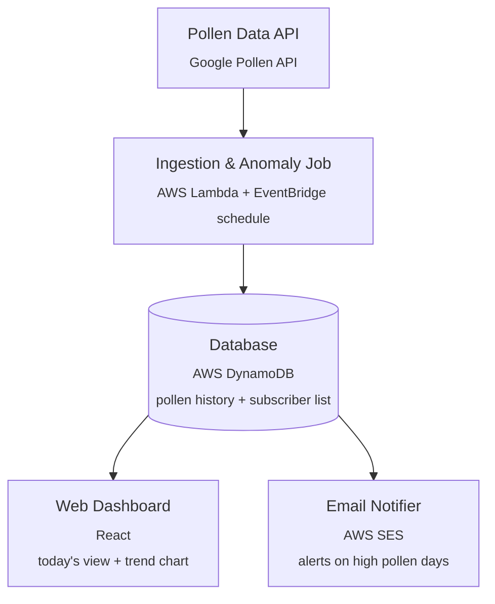

# Allergy Tracker

A small end-to-end system that pulls daily pollen forecasts, stores the history, shows it on a
web dashboard, and emails subscribers when pollen counts spike. Built primarily as a hands-on
project for learning AWS (Lambda, DynamoDB, SES, EventBridge) and basic event-driven system
design — not a production allergy service.

## How it works

1. A scheduled job fetches pollen data for one or more locations from the **Google Pollen API**.
2. The job checks the result against a per-subscriber threshold ("anomaly check") and writes the
   reading to the database either way, so history builds up over time.
3. A **web dashboard** reads that history to show today's pollen levels and a trend chart.
4. When a reading crosses a subscriber's threshold, an **email notifier** sends an alert.



> **Note on the diagram:** the dashboard is drawn reading straight from DynamoDB for simplicity,
> matching the original design. In practice the React app shouldn't talk to DynamoDB directly
> (no safe way to scope credentials in a browser). Phase 6 below adds a thin read API
> (API Gateway + Lambda) between the dashboard and the database — see
> [`docs/IMPLEMENTATION_PLAN.md`](docs/IMPLEMENTATION_PLAN.md).

## Tech stack

| Component          | Choice                          | Notes |
|---------------------|----------------------------------|-------|
| Pollen data source   | Google Pollen API (`pollen.googleapis.com`) | Requires a Google Cloud API key |
| Ingestion job        | AWS Lambda + EventBridge (scheduled rule) | Serverless, cheap, runs a few times a day |
| Database              | AWS DynamoDB                    | Single-table design: pollen history + subscribers |
| Read API              | API Gateway + Lambda            | Sits between dashboard and DynamoDB |
| Web dashboard         | React                            | Today's view, trend chart, subscribe form |
| Email notifier        | AWS SES                          | Triggered by the ingestion job or DynamoDB Streams |
| Infra as code         | AWS SAM or CDK                  | TBD in Phase 0 |

## Repository layout

```
services/
  src/ingest/       # Ingestion Lambda (fetches pollen data, writes to DynamoDB)
ui/                 # React dashboard
scripts/            # One-off / exploratory scripts (e.g. sample Pollen API fetch)
docs/               # Implementation plan and design notes
```

## Local development

Ingestion Lambda (Python):

```bash
cd services/src/ingest
pip install -r requirements.txt
python -m handler   # runs locally; uses a mocked payload if POLLEN_API_URL is unset
```

Web dashboard (React):

```bash
cd ui
npm install
npm run dev
```

See [`docs/IMPLEMENTATION_PLAN.md`](docs/IMPLEMENTATION_PLAN.md) for the phased build-out plan.
